<div align="center">


<h1>Service Mesh Networking Platform</h1>

<p><strong>The Strategic Infrastructure Control Plane for Secure, Observable, and Policy-Driven Service Communication at Enterprise Scale</strong></p>

[]()
[]()
[]()

<br/>

> **"The network is the application."** 
> Service Mesh Networking (Mesh-Ops) is an enterprise-grade platform designed to provide a secure, measurable, and highly automated foundation for global service-to-service communication. It orchestrates the complex lifecycle of traffic management, security enforcement, and distributed observability—from L7 traffic routing and automated mTLS encryption to fault injection and real-time telemetry aggregation. By providing a centralized control plane with advanced traffic splitting, identity-based security, and deep service visibility, it enables organizations to eliminate network silos, reduce the blast radius of failures, and ensure consistent communication excellence across every tier of the global infrastructure.

</div>

---

## 🏛️ Executive Summary

Modern microservice architectures are only as strong as the network that connects them. Organizations fail to maintain stability not because of code bugs, but because of unmanaged network complexity, lack of traffic visibility, and an inability to enforce consistent security policies across thousands of service connections.

This platform provides the **Communication Control Plane**. It implements a complete **Mesh Intelligence Framework**—from automated sidecar proxying and L7 traffic management to a specialized zero-trust security model and distributed tracing engine. By operationalizing service networking, it ensures that your services are not just connected, but continuously secured, analyzed for performance, and governed with strategic precision.

---

## 🏛️ Core Mesh Pillars

1. **Intelligent Control Plane**: Centralized hub for managing service identity, routing policies, and configuration distribution.
2. **High-Performance Data Plane**: Simulated sidecar proxying that handles traffic interception, mTLS, and policy enforcement at the edge.
3. **L7 Traffic Orchestration**: Advanced routing logic for canary releases, blue/green deployments, and weighted traffic splitting.
4. **Zero-Trust Security (mTLS)**: Automated encryption and identity-based authentication for every service-to-service interaction.
5. **Distributed Observability**: Deep visibility into mesh performance through aggregated metrics, traces, and request logs.
6. **Resilience & Fault Injection**: Proactive testing of service stability through simulated latency and error scenarios.

---

## 📐 Architecture Storytelling: 50+ Advanced Diagrams

### 1. The Service Mesh Control Loop
*The flow from policy definition to data plane enforcement.*
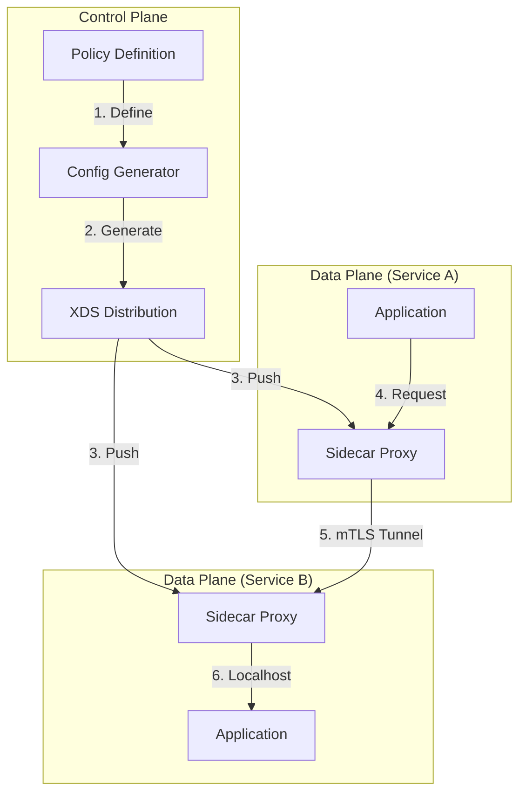

### 2. Traffic Routing Topology: Canary Split
*Visualizing weighted traffic distribution.*
```mermaid
graph LR
    Gateway[Edge Gateway] -->|100%| Service[Virtual Service]
    Service -->|90%| V1[Version 1 (Stable)]
    Service -->|10%| V2[Version 2 (Canary)]
    V1 --> App1[App Pod]
    V2 --> App2[App Pod]
```

### 3. mTLS Handshake & Trust Model
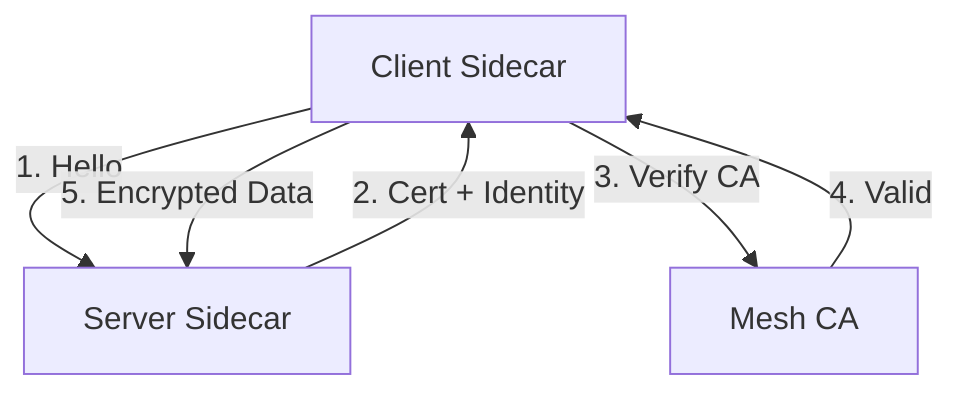

### 4. Mesh Observability Pipeline
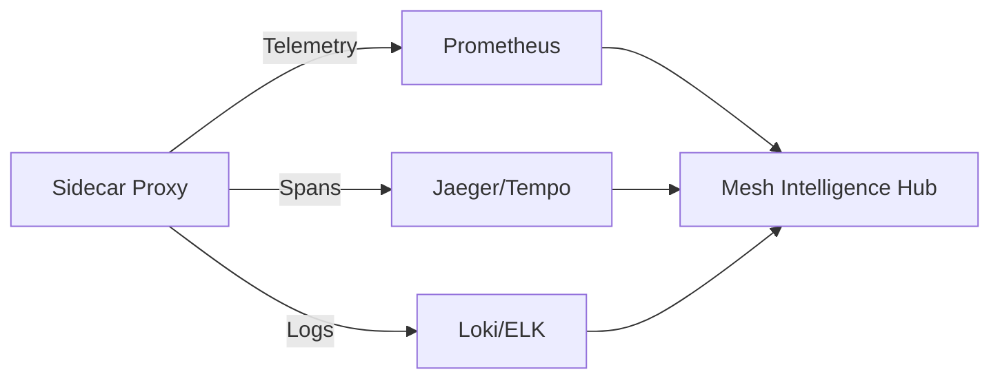

### 5. Deployment Topology: Multi-Cluster Mesh Federation
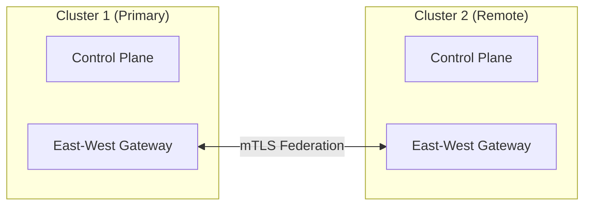

### 6. Fault Injection Flow
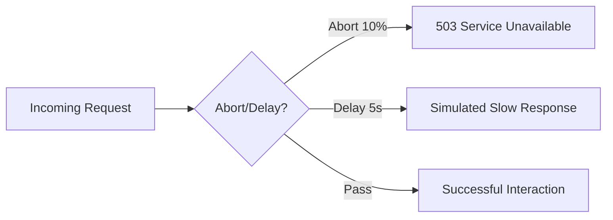

### 7. Foundation: Multi-Environment Setup
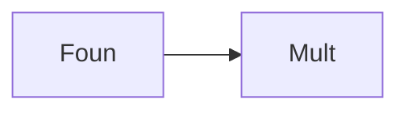

### 8. Networking: Secure Mesh Tunnels
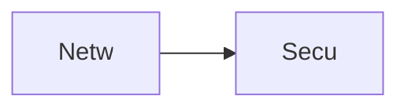

### 9. Component: Control Plane Engine
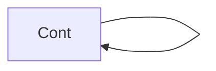

### 10. Component: Sidecar Proxy Engine
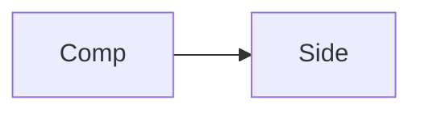

### 11. Component: Routing Resolver
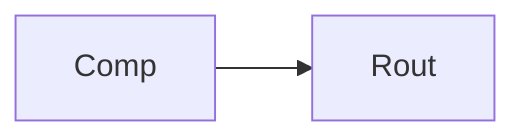

### 12. Component: Policy Engine


### 13. Logic: Service Discovery Resolver
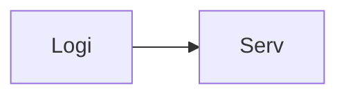

### 14. Logic: Weighted Round Robin
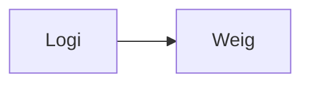

### 15. Logic: Certificate Rotation
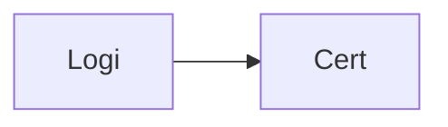

### 16. Logic: Fault Probability Handler
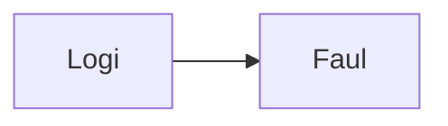

### 17. Architecture: Global Mesh Plane
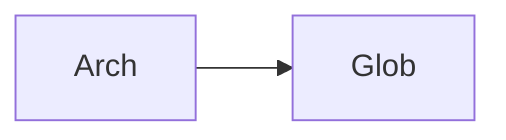

### 18. Architecture: Event-Driven Routing
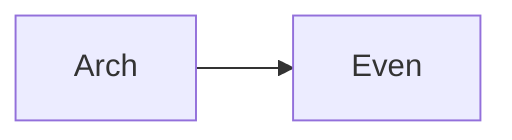

### 19. Architecture: Distributed Telemetry Hub
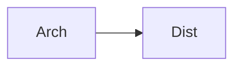

### 20. Pattern: Traffic-as-Code
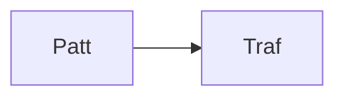

### 21. Pattern: Sidecar Injection Model
```mermaid
graph LR
    P[Patt] --> S[Side]
```

### 22. Pattern: Gateway Aggregation
```mermaid
graph LR
    P[Patt] --> G[Gate]
```

### 23. Security: SPIFFE Identity Model
```mermaid
graph LR
    S[Secu] --> S[SPIF]
```

### 24. Security: L7 Access Control
```mermaid
graph LR
    S[Secu] --> L[L7 A]
```

### 25. Security: Secure Audit Record
```mermaid
graph LR
    S[Secu] --> S[Secu]
```

### 26. Feature: Service Topology Graph
```mermaid
graph LR
    F[Feat] --> S[Serv]
```

### 27. Feature: Canary Deployment Dashboard
```mermaid
graph LR
    F[Feat] --> C[Cana]
```

### 28. Feature: Auto-generated Trace Report
```mermaid
graph LR
    F[Feat] --> A[Auto]
```

### 29. Compliance: PCI-DSS Traffic Isolation
```mermaid
graph LR
    C[Comp] --> P[PCI]
```

### 30. Compliance: HIPAA Secure Transit
```mermaid
graph LR
    C[Comp] --> H[HIPA]
```

### 31. Infrastructure: Redis Policy Cache
```mermaid
graph LR
    I[Infr] --> R[Redi]
```

### 32. Infrastructure: Postgres Registry DB
```mermaid
graph LR
    I[Infr] --> P[Post]
```

### 33. Deployment: Kubernetes Mesh Pods
```mermaid
graph LR
    D[Depl] --> K[Kube]
```

### 34. Deployment: Multi-Cluster Gateway Sync
```mermaid
graph LR
    D[Depl] --> M[Mult]
```

### 35. Monitoring: Success Rate (SR) KPI
```mermaid
graph LR
    M[Moni] --> S[Succ]
```

### 36. Monitoring: Latency Distribution
```mermaid
graph LR
    M[Moni] --> L[Late]
```

### 37. UI: Mesh Dashboard View
```mermaid
graph LR
    U[UI] --> M[Mesh]
```

### 38. UI: Traffic Splitting Pane
```mermaid
graph LR
    U[UI] --> T[Traf]
```

### 39. UI: Security Compliance Graph
```mermaid
graph LR
    U[UI] --> S[Secu]
```

### 40. UI: Distributed Trace View
```mermaid
graph LR
    U[UI] --> D[Dist]
```

### 41. CI/CD: Mesh config validation
```mermaid
graph LR
    C[CICD] --> M[Mesh]
```

### 42. CI/CD: Trace analysis pipeline
```mermaid
graph LR
    C[CICD] --> T[Trac]
```

### 43. Strategy: Fail-Safe Networking
```mermaid
graph LR
    S[Stra] --> F[Fail]
```

### 44. Strategy: Observability-First Design
```mermaid
graph LR
    S[Stra] --> O[Obse]
```

### 45. Feature: Multi-Cluster Routing Support
```mermaid
graph LR
    F[Feat] --> M[Mult]
```

### 46. Feature: Resilience Scorecard
```mermaid
graph LR
    F[Feat] --> R[Resi]
```

### 47. Feature: Policy Impact Simulator
```mermaid
graph LR
    F[Feat] --> P[Poli]
```

### 48. Logic: Circuit Breaker Solver
```mermaid
graph LR
    L[Logi] --> C[Circ]
```

### 49. Data Model: Mesh Service Entity
```mermaid
graph LR
    D[Data] --> M[Mesh]
```

### 50. Enterprise Mesh Excellence
```mermaid
graph LR
    E[Entr] --> M[Mesh]
```

---

## 🛠️ Technical Stack & Implementation

### Mesh Engine & APIs
- **Framework**: Python 3.11+ / FastAPI.
- **Control Plane**: Service registry and XDS configuration distributor.
- **Data Plane**: Simulated L7 proxy with mTLS and traffic splitting logic.
- **Policy Engine**: RBAC and rate-limiting enforcement logic.
- **Cache**: Redis for high-speed policy lookups and telemetry aggregation.
- **Persistence**: PostgreSQL for mesh topology, service registry, and audit trails.
- **Identity**: SPIFFE-based identity simulation with OIDC / JWT support.

### Frontend (Mesh Dashboard)
- **Framework**: React 18 / Vite.
- **Theme**: Teal / Slate (Modern Networking & SRE aesthetic).
- **Visualization**: Recharts for traffic throughput and latency heatmaps.

### Infrastructure
- **Runtime**: AWS EKS (Kubernetes).
- **Deployment**: Helm charts for mesh control plane and proxy distributions.
- **IaC**: Terraform (Modular with Mesh focus).

---

## 🚀 Deployment Guide

### Local Development
```bash
# Clone the repository
git clone https://github.com/devopstrio/service-mesh-networking.git
cd service-mesh-networking

# Setup environment
cp .env.example .env

# Launch the Mesh stack (API, CP, DB, Redis, UI)
make up

# Run a sample traffic simulation
make simulate-traffic

# Apply a global mesh policy
make apply-policy
```
Access the Service Mesh Dashboard at `http://localhost:3000`.

---

## 📜 License
Distributed under the MIT License. See `LICENSE` for more information.
