<div align="center">


<h1>Service Mesh Networking Platform</h1>

<p><strong>The Strategic Infrastructure Control Plane for Secure, Observable, and Policy-Driven Service Communication at Enterprise Scale.</strong></p>

[]()
[]()
[]()

<br/>

> **"The network is the application."** 
> **Service Mesh Networking (Mesh-Ops)** is an enterprise-grade platform designed to provide a secure, measurable, and highly automated foundation for global service-to-service communication. It orchestrates the entire lifecycle—from L7 traffic routing and automated mTLS encryption to distributed tracing and fault injection.

</div>

---

## 🏛️ Executive Summary

Modern microservice architectures are only as strong as the network that connects them. Organizations often fail to maintain stability not because of code bugs, but because of unmanaged network complexity and a lack of granular visibility into how services interact across distributed clusters.

This platform provides the **Communication Control Plane**. It implements a complete **Mesh Intelligence Framework**, enabling SRE and Platform Engineering teams to manage service connectivity as a first-class citizen. By automating sidecar proxying and the enforcement of zero-trust security policies, we ensure that the organizational services are not just connected, but continuously secured, analyzed, and governed with strategic precision.

---

## 📐 Architecture Storytelling: Principal Reference Models

### 1. Principal Architecture: Global Service Mesh & Connectivity Plane
This diagram illustrates the end-to-end flow from mesh policy definition and XDS distribution to mTLS-encrypted data plane communication and distributed telemetry.

```mermaid
graph LR
    %% Subgraph Definitions
    subgraph ControlPlane["Mesh Control Plane (Istiod/Linkerd)"]
        direction TB
        Registry["Service Discovery Registry"]
        CA["Mesh Certificate Authority (mTLS)"]
        XDS["XDS Configuration Distributor"]
        Policy["Network Policy Engine"]
    end

    subgraph DataPlane["Global Data Plane (Envoy Sidecars)"]
        direction TB
        ServiceA["Service A (App + Sidecar)"]
        ServiceB["Service B (App + Sidecar)"]
        Ingress["Mesh Ingress Gateway"]
        Egress["Mesh Egress Gateway"]
    end

    subgraph ObservabilityHub["Distributed Observability Hub"]
        direction TB
        Metrics["Prometheus (Metrics)"]
        Tracing["Jaeger / Tempo (Traces)"]
        Visualizer["Kiali / Grafana (Topology)"]
    end

    subgraph Operations["Mesh Governance & Ops"]
        direction TB
        Dash["Mesh Command Dashboard"]
        Audit["Forensic Traffic Lake"]
        Canary["Canary Release Manager"]
    end

    subgraph DevOps["Mesh-as-Code Orchestration"]
        direction TB
        GitOps["GitOps Mesh Config"]
        TF["Terraform Mesh Modules"]
        Helm["Helm Mesh Charts"]
    end

    %% Flow Arrows
    Policy -->|1. Define Policy| XDS
    Registry -->|2. Track Health| XDS
    CA -->|3. Issue Certs| DataPlane
    XDS -->|4. Push Config| DataPlane
    
    Ingress -->|5. Route Traffic| ServiceA
    ServiceA -->|6. mTLS Tunnel| ServiceB
    ServiceB -->|7. Secure Outbound| Egress
    
    DataPlane -->|8. Stream Telemetry| ObservabilityHub
    ObservabilityHub -->|9. Visualize| Dash
    Dash -->|10. Orchestrate| Canary
    
    GitOps -->|11. Commit Config| XDS
    TF -->|12. Provision Hub| ControlPlane
    Dash -->|13. Record Audit| Audit

    %% Styling
    classDef control fill:#f5f5f5,stroke:#616161,stroke-width:2px;
    classDef data fill:#ede7f6,stroke:#311b92,stroke-width:2px;
    classDef obs fill:#e8f5e9,stroke:#1b5e20,stroke-width:2px;
    classDef ops fill:#fce4ec,stroke:#880e4f,stroke-width:2px;
    classDef devops fill:#fffde7,stroke:#f57f17,stroke-width:2px;

    class ControlPlane control;
    class DataPlane data;
    class ObservabilityHub obs;
    class Operations ops;
    class DevOps devops;
```

### 2. Control Plane vs. Data Plane Orchestration
Visualizing the separation between policy management and actual traffic interception.

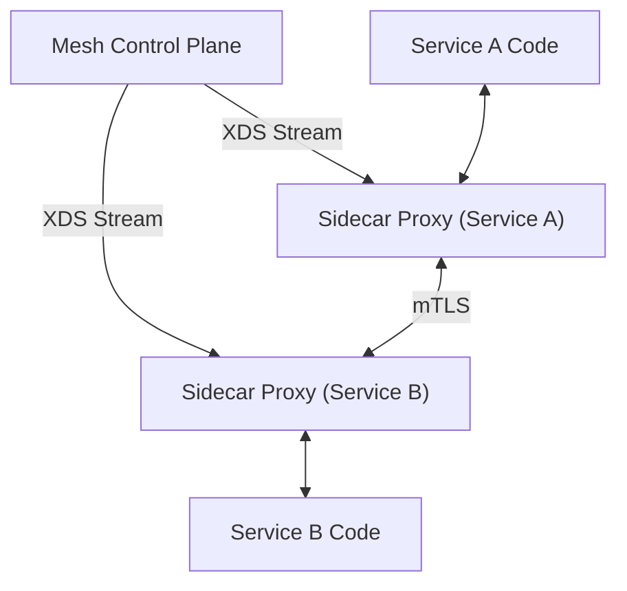

### 3. mTLS & Identity-Based Security Flow
Standardizing trust through automated certificate rotation and SPIFFE-based identities.

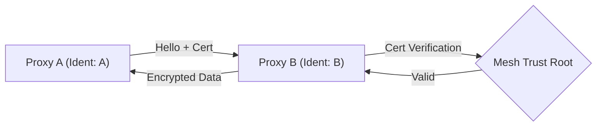

### 4. Advanced Traffic Routing: Canary Deployment
Using the mesh to split traffic between stable and experimental service versions.

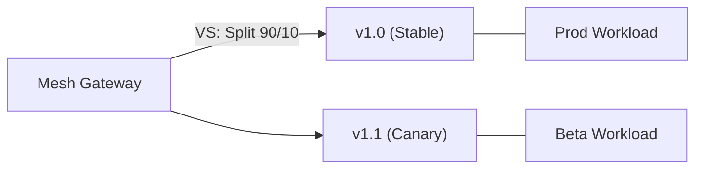

### 5. Circuit Breaking & Resilience Patterns
Proactively protecting the mesh from cascading failures using thresholds and timeouts.

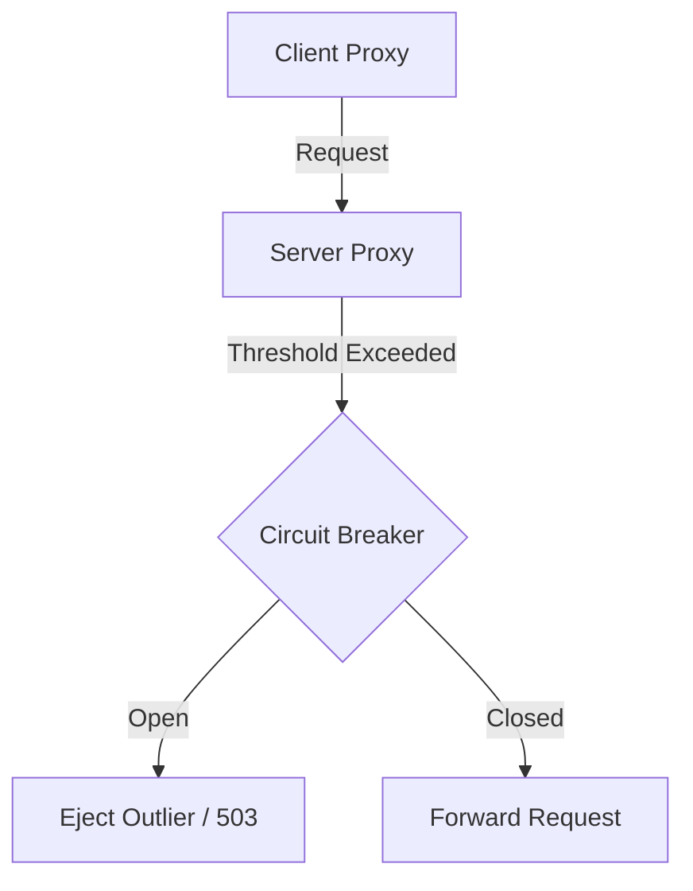

### 6. Edge Ingress & Egress Gateway Hub
Managing the North-South traffic perimeter for entry and exit from the service mesh.

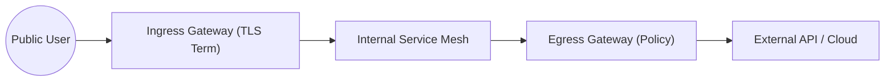

### 7. Service Discovery & Catalog Registry
Automated detection of service endpoints and continuous health validation.

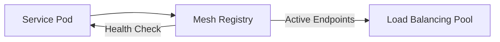

### 8. Identity & RBAC for Mesh Policies
Enforcing fine-grained communication permissions based on service identity, not IP.

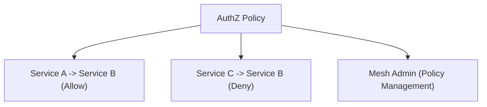

### 9. Distributed Observability Stack
The architectural layers for collecting metrics, traces, and logs from every proxy.

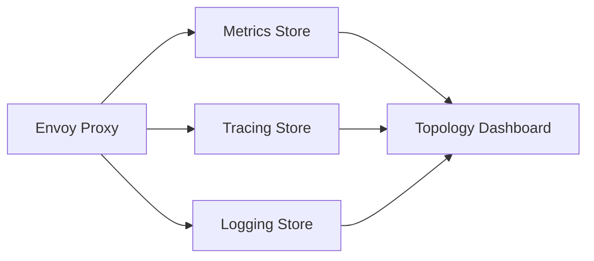

### 10. IaC Deployment: Mesh-as-Code
Using Terraform to deploy and manage the lifecycle of the mesh control plane.

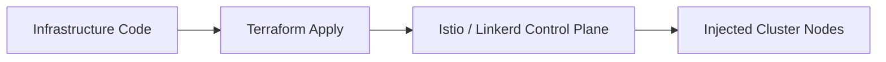

### 11. Metadata Lake for Traffic Forensics
Storing long-term service interaction data for security auditing and performance analysis.

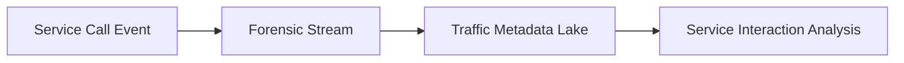

---

## 🏛️ Core Mesh Pillars

1.  **Intelligent Control Plane**: Centralized hub for managing service identity, routing policies, and configuration distribution.
2.  **High-Performance Data Plane**: Simulated sidecar proxying that handles traffic interception and mTLS enforcement.
3.  **L7 Traffic Orchestration**: Advanced routing logic for canary releases, blue/green deployments, and weighted splitting.
4.  **Zero-Trust Security (mTLS)**: Automated encryption and identity-based authentication for every service-to-service interaction.
5.  **Distributed Observability**: Deep visibility into mesh performance through aggregated metrics, traces, and request logs.
6.  **Resilience & Fault Injection**: Proactive testing of service stability through simulated latency and error scenarios.

---

## 🛠️ Technical Stack & Implementation

### Mesh Engine & APIs
*   **Framework**: Python 3.11+ / FastAPI.
*   **Control Plane**: Service registry and XDS configuration distributor for Envoy proxies.
*   **Data Plane**: Simulated L7 proxy logic with mTLS and traffic splitting support.
*   **Policy Engine**: Strategic RBAC and rate-limiting enforcement for microservices.
*   **State Management**: PostgreSQL (Mesh Topology) and Redis (Telemetry Cache).

### Mesh Dashboard (UI)
*   **Framework**: React 18 / Vite.
*   **Theme**: Teal / Slate (Modern Networking & SRE aesthetic).
*   **Visualization**: Recharts for traffic throughput trendlines and latency heatmaps.

### Infrastructure & DevOps
*   **Runtime**: AWS EKS or Azure Kubernetes Service (AKS).
*   **IaC**: Modular Terraform for deploying the mesh control plane and gateway configurations.

---

## 🏗️ IaC Mapping (Module Structure)

| Module | Purpose | Real Services |
| :--- | :--- | :--- |
| **`infrastructure/control-plane`** | Central mesh management | EKS, Istio, Linkerd, Consul |
| **`infrastructure/gateways`** | Ingress and Egress control | Envoy, NGINX, Gateway API |
| **`infrastructure/security`** | Identity and mTLS roots | SPIRE, Cert-Manager, Vault |
| **`infrastructure/observability`** | Telemetry and tracing sinks | Prometheus, Jaeger, Kiali |

---

## 🚀 Deployment Guide

### Local Principal Environment
```bash
# Clone the service mesh platform
git clone https://github.com/devopstrio/service-mesh-networking.git
cd service-mesh-networking

# Configure environment
cp .env.example .env

# Launch the Mesh stack
make up

# Run a sample traffic simulation
make simulate-traffic

# Apply a global mesh routing policy
make apply-policy
```

Access the Service Mesh Dashboard at `http://localhost:3000`.

---

## 📜 License
Distributed under the MIT License. See `LICENSE` for more information.

---
<div align="center">
  <p>© 2026 Devopstrio. All rights reserved.</p>
</div>
